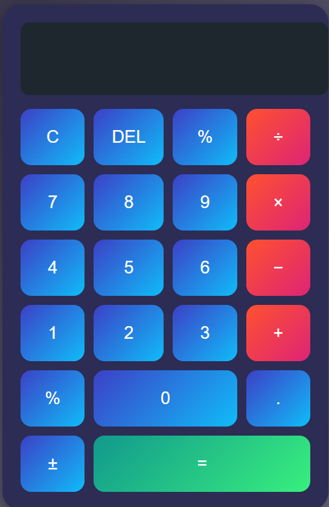

# 📱 Web Calculator

A simple and beginner-friendly calculator built with **HTML, CSS, and JavaScript**.  
Performs basic arithmetic operations (addition, subtraction, multiplication, division) with a clean, responsive UI.


## ✨ Features
- Basic operations: **+ − × ÷**
- **Clear / Reset** button
- **Responsive** layout (mobile + desktop)
- **Keyboard support** (optional, if implemented)
- Lightweight & beginner friendly


## 🚀 Live Demo
👉 [View Calculator](https://raila-shaukat.github.io/Web-Calculator/)


## 🛠️ Technologies Used
- **HTML5** – structure
- **CSS3** – styling
- **JavaScript (ES6)** – logic & interactions

---

## 📸 Screenshot




---

## 📂 Getting Started

### 1) Clone the repo
```bash
git clone https://github.com/raila-shaukat/Web-Calculator.git

